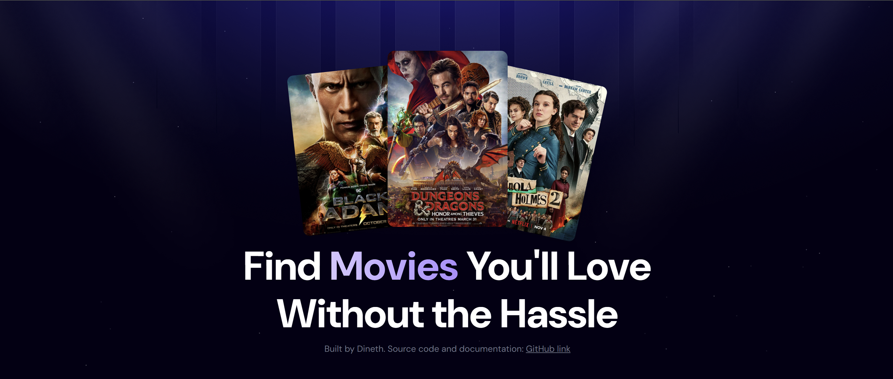
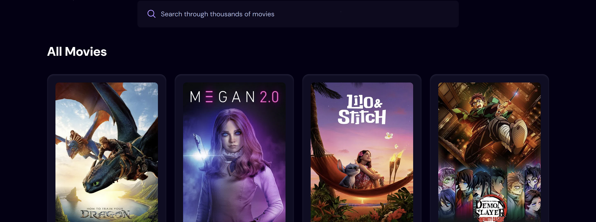

# Movie Search App using React and TailwindCSS

This is a single page application for searching up Movies.
I built it to improve my React skills (using an API in particular), and also to learn Tailwind.

I intergrated the TMDB (The Movie Database) API for this project.
It has a search function with debouncing implemented to avoid overwhelming the API with queries.

you can visit the site at: https://movieapp.dinethwick.com/

